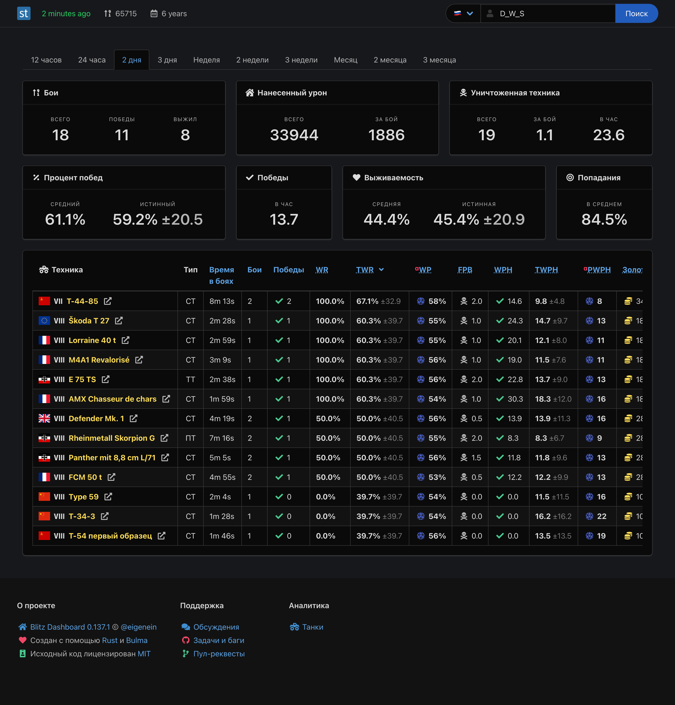

[](https://github.com/eigenein/blitz-dashboard/commits/master)
[](https://github.com/eigenein/blitz-dashboard/actions)


## Blitz Dashboard



## Installation

Grab a binary for Raspberry Pi 4 from the [releases](https://github.com/eigenein/blitz-dashboard/releases), or:

```shell
cargo install --git 'https://github.com/eigenein/blitz-dashboard.git' --branch main --locked
```

## Setting up

### Prerequisites

- PostgreSQL ≥ `13.4`
- Redis ≥ `6.2.6`

These are the versions I'm running with. Lower versions may work, but I haven't tested them.

### Overview

Blitz Dashboard consists of a single executable `blitz-dashboard`, which serves multiple sub-commands:

- [Web application](src/web.rs)
- [Account crawler](src/crawler.rs): the service process and the one-off tool
- [Analytics aggregator](src/aggregator.rs)
- [Tankopedia importer](src/tankopedia.rs)

### Wargaming.net API considerations

TODO

## Monitoring

I use the following free accounts:

- [Sentry](https://sentry.io/): to keep track of errors and get the alerts
- [Better Uptime](https://betteruptime.com/): to track the website status
- [Redsmin](https://www.redsmin.com/): to edit the runtime configuration in Redis
